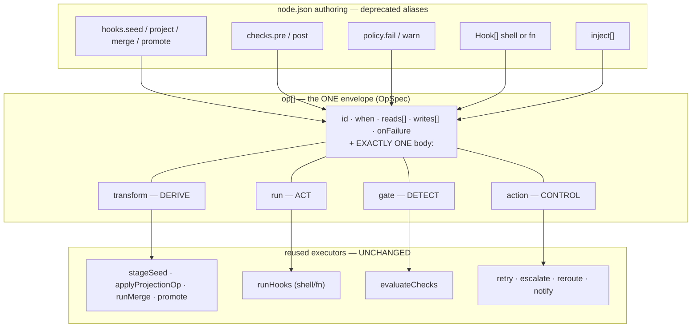
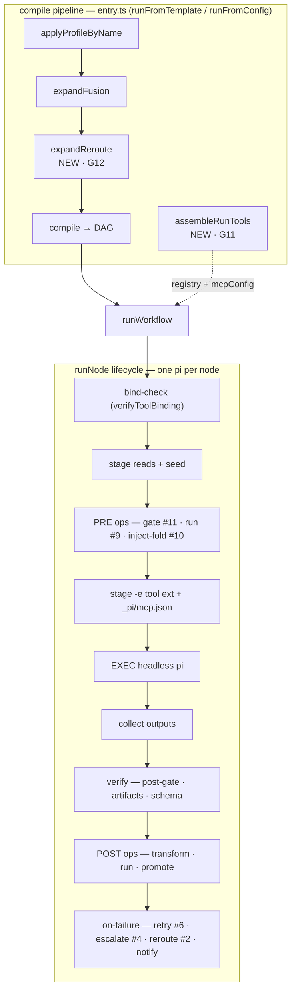
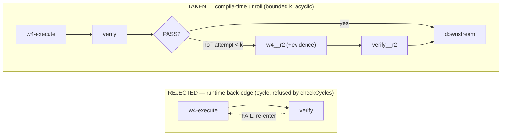

# Node Action Protocol — The Unified Node-Op / Trigger-Action / Tool-Wiring Architecture

> **Status:** CONVERGED DESIGN (canonical). Supersedes the prose-only correctness story and the three fragmented op grammars. This is the single architecture for **G11 (tool-wiring)**, **G12 (control-flow / trigger-actions)**, and **G13 (the unified op envelope)** — three coupled threads, one principle.
> **Provenance:** distils the investigation `docs/research/2026-06-25-node-action-surface-and-tool-wiring-investigation.md` (24 deduped defects, 2 blockers) through a design brief, three lens-proposals (unification · control-flow · tool-wiring), a scoring judge, and an adversarial critique pass. The fix sequence lives in `docs/specs/node-action-protocol-fix-plan.md`. All code anchors below were independently re-verified against the working tree (branch `docs/node-action-protocol`).
> **Hard constraints (non-negotiable, each pinned):** FROZEN SPINE — additive by default, widening justified (`packages/core/src/types.ts:10-11`, canon `docs/design/l1-node-envelope.md:8,21`); ADDITIVE — a node declaring none of the new fields runs BYTE-IDENTICALLY (`types.ts:51-58,59-66`); PRODUCT-AGNOSTIC SDK (`CLAUDE.md:4-5`, the `SecretResolver` seam `types.ts:478,484`); TEST-FIRST — every milestone gated by a test that FAILS when the code is wrong, incl. the live-pi E2E (`packages/core/test/runner-live-tool-e2e.test.ts`).

---

## 0. Architecture at a glance

**The unified envelope — every old grammar lowers into one `op[]`:**



*The loader lowers every deprecated alias into `op[]`; the per-transform executors are reused unchanged (the envelope changes only the authoring + dispatch frame).*

**Where it plugs into a run — compile pipeline + the per-node lifecycle:**



*`assembleRunTools` (G11) seeds the catalog into the canonical path; `expandReroute` (G12) unrolls the bounded QA loop; the `op[]` envelope (G13) fires at the PRE / verify / POST / on-failure points of `runNode`.*

**Bounded reroute — refuse the back-edge, unroll it (the QA loop without a cycle):**



*A verify FAIL re-enters an upstream node as compile-time-cloned acyclic stages (the `expandFusion` move), bounded by `k`; `checkCycles` is never modified (design §3-control).*

---

## 1. Problem & convergence

The investigation found one disease with three organs. **(a) Tool-wiring is built but unreachable** — `seededRegistry()`/`loadCatalog()` have ZERO non-test callers, so every canonical run falls through to `registry: opts.registry ?? new DefaultToolRegistry()` (`packages/core/src/runner/runner.ts:1347`), a builtins-only registry; any `oc.*`/`mcp.*` node is `blocked` before `pi` spawns (BLOCKER #1). **(b) Conditional control-flow lives in prose** — a verify FAIL has no authoring surface to re-enter an upstream node, and the loader rejects cycles outright (`checkCycles`, Kahn topo-sort, `packages/core/src/workflow/template/checks.ts:47-74`) (BLOCKER #2). **(c) The op surface is fragmented** — ~8 op grammars, 6 I/O declaration styles, and 5 inline consequence encodings, against exactly ONE clean decision⊥consequence factoring in the whole codebase: `checks` (detection) ⊥ `policy` (consequence) (`types.ts:179-203`). The convergence is to **extend that one good factoring to the whole surface** rather than invent a parallel one: every op DETECTS, DERIVES, ACTS, or CONTROLS, and every outcome routes through ONE shared consequence vocabulary; the tool catalog is seeded into the canonical run path once; and the bounded QA loop is UNROLLED at compile time exactly as `expandFusion` already unrolls a fusion node into a bounded acyclic sub-DAG (`packages/core/src/workflow/fusion/expand.ts:68`, inserted in `runFromConfig` at `packages/core/src/runner/entry.ts:71` and in `runFromTemplate` at `:109`). The three organs are sequenced G11 → G12 → G13 (foundation → control-flow → grammar); see §5 and the fix plan.

---

## 2. The unified node action/op protocol

### 2.1 The envelope — `OpSpec`

One discriminated record. A node carries an ordered `op[]`; every existing grammar is a **profile** of this one shape, and the per-transform executors (`seed.ts`/`project.ts`/`merge.ts`/`promote.ts`/`checks.ts`) are reused UNCHANGED — the envelope changes only the authoring + dispatch frame, never the transform logic.

```ts
// packages/core/src/types.ts — the ONE node-op envelope (G13). Additive; see §5 for the spine accounting.
export type OpWhen   = 'pre' | 'post' | 'on-success' | 'on-failure' | 'always';   // extends HookWhen (types.ts:286)
export type OnFailure = 'block' | 'warn' | 'stop' | 'retry' | 'escalate';         // = PolicyAction, generalized (§2.4)

export interface OpSpec {
  id?: string;            // ledger key + resume key + the reroute target (#2). SDK-fills a slug if omitted.
  when?: OpWhen;          // firing phase/condition. Default 'post'. (the dbt-#1-pain `when` knob, made explicit)
  reads?: string[];       // files READ — fold into DAG edge inference AND (for pre ops) into the realized prompt
  writes?: string[];      // files WRITTEN — the produced set the next node's `reads` draws an edge from
  onFailure?: OnFailure;  // the consequence of THIS op failing. Default 'block'. (the checks⊥policy split, universal)
  idempotent?: boolean;   // skip when outputs fresh. Default true. (carried from Hook.idempotent)

  // EXACTLY ONE body (the discriminator; the loader rejects a multi-body op — the `mergeHook` oneOf precedent):
  transform?: TransformBody; // DERIVE — declarative data transform (seed/project/merge/promote/registryProject)
  run?: RunBody;             // ACT — deterministic shell/fn side-effect (the ported, now-authorable Hook.run). Never an LLM.
  gate?: GateBody;           // DETECT — pure predicate over `reads` emitting a verdict (the Check family)
  action?: ActionBody;       // CONTROL — model-free control action (retry/escalate/notify/rerouteTo) — the G12 family
}
```

The four bodies (the op **classes**):

```ts
export type TransformBody =
  | { kind: 'seed';      from: string }                                   // PRE  (seed.ts:42 from-token grammar)
  | { kind: 'project';   ops: Record<string, unknown>[] }                // POST (copy|assemble|merge|union)
  | { kind: 'merge';     ops: Record<string, unknown>[] }                // POST (fold|concat|reconcile; `run` removed → RunBody)
  | { kind: 'promote';   from: string; to: string; reducer?: Reducer }   // POST (state lift, promote.ts:23)
  | { kind: 'projectRegistry'; source: string; mapRef: string; key: string }; // POST (registry projections)

export type RunBody  = { cmd: string; args?: string[]; cwd?: string } | { fn: string };
export type GateBody = { kind: CheckKind | string; path?: string; param?: unknown; advisory?: boolean }; // advisory = Dagster blocking=False
export type ActionBody =                                                  // G12 owns the runtime; G13 owns the SLOT
  | { kind: 'retry';     onVerdict?: 'fail' | 'warn'; max?: number }      // #6
  | { kind: 'escalate';  via: string; evidence?: string[] }              // #4 — `via` resolves through model-routing.ts
  | { kind: 'notify';    channel: string; payload?: string[] }           // §4 — `channel` is a host-seam key (Escalator)
  | { kind: 'rerouteTo'; node: string; max: number; evidence?: string[] }; // #2 — compile-time unrolled (§3-control)
```

### 2.2 The migration table — every existing grammar → one `OpSpec`

The right column is the report issue each row closes. Most rows are byte-identical lowerings; **two rows (4 and 9) are deliberate behavior ADDITIONS, marked ⊕** — a today-swallowed or today-dead surface that gains a real effect. The old authoring keys (`hooks`/`ops`/`checks`/`policy`) remain SUPPORTED `@deprecated` aliases the loader lowers into `op[]`, so every existing template compiles + runs identically (Constraint #2).

| # | Today (grammar · file:line) | Unified `OpSpec` | Reused executor | Closes |
|---|---|---|---|---|
| 1 | `hooks.seed:[{to,from}]` (`seed.ts:93`) | `{when:'pre', writes:[to], transform:{kind:'seed',from}}` | `stageSeed` | — (preserve) |
| 2 | `hooks.project:[{to,from}]` | `{when:'post', writes:[to], reads:from, transform:{kind:'project',ops}}` | `applyProjectionOp` | — |
| 3 | `hooks.merge:{ops}` (`merge.ts:39`) | `{when:'post', transform:{kind:'merge',ops}}` | `applyMergeOp` (minus `run`) | — |
| 4 ⊕ | `hooks.merge` **`run` op** (`merge.ts:175`) — exit code is **SWALLOWED today** (`await runMerge(...)` return DISCARDED, `runner.ts:980`; the node only blocks if its missing output trips the existence gate) | `{when:'post', run:{cmd,args,cwd}, onFailure:'block'\|'warn'}` — the exit code now ROUTES to status | `spawnSync` body → `RunBody` | **#18** (ADDITION) |
| 5 | `hooks.promote:[{from,to,merge}]` (`promote.ts:23`) | `{when:'post', transform:{kind:'promote',from,to,reducer}}` | `extractPromoteValue`+`barrierMerge` | — |
| 6 | `hooks.registryProject` | `{when:'post', transform:{kind:'projectRegistry',…}}` | `runProjection` (incl. `union`, `project.ts:184`) | **#12** |
| 7 | `NodeSpec.hooks.pre/post:Hook[]` (`types.ts:48`, unauthorable) | `{when, reads, writes, run:{cmd}\|{fn}, onFailure}` | `runHooks` | **#9**, **#22** |
| 8 | `checks.post:[Check]` | `{when:'post', gate:{kind,path,param}, onFailure:<from policy>}` | `evaluateChecks` | — |
| 9 ⊕ | `checks.pre:[Check]` (DEAD today — flattened pre→post in `render.ts`, never fires before the model) | `{when:'pre', gate:{…}, onFailure}` run BEFORE the model | `evaluateChecks` | **#11** (ADDITION) |
| 10 | `policy:{fail,warn}` (`types.ts:257`) | folded into each `gate`'s `onFailure` | `actionForVerdict` (`checks.ts`) | **#15** (§2.4) |
| 11 ⊕ | `inject:[path]` — `io.reads` is hardcoded `[]` (`loader.ts:121`, the comment at `:119-120` is stale/aspirational), so injected reads NEVER fold into the prompt | `{when:'pre', reads:[path]}` whose `reads` IS folded into the prompt | new pre-fold step (a new behavior) | **#10**, **#16** (ADDITION) |
| 12 | `contract.artifacts` existence (inline) | stays in `io.artifacts`; `gate{kind:'exists'}` is the generalization, artifacts the required-output sugar | `runner.ts` artifact stat | — |
| 13 | `returnSchema` breach (inline) | stays in `io`; `returnMode:'required'` is sugar for `gate{kind:'json-schema',onFailure:'block'}` | `runner.ts` return parse | — |

`project` and `merge` stay as two `transform.kind`s (porting fidelity, investigation §2): the envelope unifies the FRAME `{when,reads,writes,transform}` while keeping the two op-vocabularies (`copy|assemble|merge|union` vs `fold|concat|reconcile`) as the `kind` discriminator — zero behavior change for the transform itself, "8 grammars" become "one envelope with a typed `kind`."

### 2.3 The 6 I/O styles collapse into one (`reads[]`/`writes[]`)

The 6 conventions (`io.reads`/`io.produces` · `contract.artifacts` · sandbox `read`/`write` · `seed{to,from}` · per-op source/dest · `Hook[]{inputs,outputs}`) collapse because **every op declares its own `reads[]`/`writes[]` in ONE vocabulary**, and the loader DERIVES the node-level sets from the union — replacing the hard-coded `reads: []` (`packages/core/src/workflow/template/loader.ts:121`, the root of #16 and #10; note `io.produces` is already set from `contract.artifacts` at `:122`, only `io.reads` is vestigial):

```ts
// loader.ts — replaces the `reads: []` hardcode at :121 (and removes the now-true comment at :119-120):
const opReads  = (node.op ?? []).flatMap(o => o.reads  ?? []);
const opWrites = (node.op ?? []).flatMap(o => o.writes ?? []);
io.reads    = unique([...injectReads, ...opReads]);            // #10/#16: edges from io, no longer vestigial
io.produces = unique([...contract.artifacts, ...opWrites]);    // #16: produces = artifacts ∪ op writes
```

Sandbox `read`/`write` (`types.ts` SandboxSpec) is NOT unified away — it is OS-enforcement scope (concern #1), a different axis (security, not data-flow); the loader keeps deriving it from `contract.readScope`/`owns`. The four inner value-extraction token grammars (`seed {file:field}` `seed.ts:42`, `promote <art>:<field>` `promote.ts:79`, project bare paths, `checks.path`) keep their resolvers — they are value-extraction INSIDE a body, not I/O declaration; unifying them touches three executors for zero behavior gain and is an explicit non-goal (§7).

### 2.4 The extended decision ⊥ consequence model

`checks` ⊥ `policy` is the ONE clean split (`types.ts:179`). The protocol generalizes it three-way — **detection ⊥ consequence ⊥ control** — and makes `onFailure` the single consequence vocabulary that the runner's status ladder reads uniformly (today a hard-coded cascade where `blockingChecks` is filtered by `actionForVerdict(...) !== 'warn'`, `packages/core/src/runner/runner.ts:1018`):

| Inline consequence today | file:line | Today's reality | Routes through |
|---|---|---|---|
| `merge.run` exit code | `merge.ts:175`, call site `runner.ts:980` | **SWALLOWED** — `runMerge`'s `{failed,exit}` return is discarded; only a missing output blocks the node | `RunBody` op's `onFailure` (default `block`; author sets `warn`) — **#18 (ADDITION)** |
| `Hook.failure:'block'\|'warn'` | `types.ts` Hook | unauthorable (`hooks.pre/post` not author-reachable) | op `onFailure` (lowered) — **#9** |
| artifact existence | `runner.ts` | live (the existence gate) | `gate{kind:'exists'}` or `io.artifacts` sugar |
| `returnSchema` breach | `runner.ts` | live under `returnMode:'required'` | `gate{kind:'json-schema'}` under `returnMode:'required'` |
| check verdict → `policy` | `checks.ts` | live (the one clean split) | `onFailure` is `actionForVerdict` promoted to a per-op field |

**On `stop` vs `block` (#15) — corrected against the runner as it actually executes.** The earlier framing ("`block` halts fast mid-stage; `stop` lets siblings drain") rested on a mid-stage abort that DOES NOT EXIST. The runner runs each stage with `Promise.all(s.nodeIds.map(...))` and sets `halted = true` only AFTER every lane resolves (`runner.ts:1543,1589`); the sole `AbortController` (`runner.ts:293,306`) is the per-node watchdog, NOT a stage-cancel. **So today's `block` ALREADY drains all same-stage siblings to completion and only then halts before the next stage** — there is no "halt-now" behavior to contrast `stop` against. Two honest options exist, and the protocol takes (B):

- **(A) — REJECTED:** give `block` a NEW mid-stage sibling-cancel (drive `ac.abort()` across the stage's other lanes on first failure) so `stop` becomes the graceful contrast. This CHANGES `block`'s observable behavior for every existing block-policy template (a sibling that completes today would be cancelled tomorrow) → it BREAKS additivity (Constraint #2) and is out of scope.
- **(B) — TAKEN:** `stop` is a DOCUMENTED ALIAS of `block` (both: fail the node, drain same-stage siblings, halt before the next stage — the current, unchanged semantics) and the name is RESERVED for a future graceful-cancel primitive once a stage-cancel exists. #15 is closed as "documented-equivalence + the verdict→consequence split is unified through `onFailure`," NOT as "`stop` gains a distinct mid-stage effect." The legacy `PolicyAction` already treats `retry-once`/`subagent-fix` as `block` (`types.ts:200`); `stop≡block` is consistent with that.

`retry`/`escalate` gain real, distinct effect via the `action` family (§3-control), NOT by overloading `policy` — keeping `policy` pure verdict→consequence and `action` the control layer.

---

## 3. The trigger-action vocabulary (G12)

The legacy `run.mjs` had the whole family working (`runNodeWithEscalation`/`classifyFailure`/`consultPreamble`); the SDK port stopped at `io.retries` (error/blocked only) and `actionForVerdict` (collapses to `block`). The protocol restores six verbs — each is a model-free `action` op (or its canonical `NodeIO`/`NodeIntent` field), with semantics + an authoring example + the framework precedent it ports.

**retry-by-failure-class** — re-run THIS node (a fresh attempt: re-seed + re-exec) up to a bound, FILTERED by the failure class the runner DERIVES (it stats the files the node was required to produce — it does not ask the model "are you sure"). Canonical field: `io.retry?: { max, on?: FailureClass[] }`; `io.retries` (`types.ts:277`) is preserved as the `legacyRetry(io.retries)` alias (max=retries, classes=`['infra','degenerate']` ≈ today's error/blocked). Precedent: Temporal `RetryPolicy` per-failure-type backoff; LangGraph/Dagster per-node `RetryPolicy`. Closes **#6**.
```jsonc
"checks": { "post": [{ "kind": "fenced-tail", "param": { "minItems": 3 }, "severity": "fail" }] },
"policy": { "fail": "retry" },
"retry":  { "max": 1, "on": ["quality-gap", "degenerate"] }
```

> **The `schema`/`degenerate-output` failure-class lane composes G8 (SHIPPED design `docs/specs/wiring-g8-repair-loop.md`).** When the DERIVED class is a SCHEMA miss (the node `block`ed SOLELY on `schema.invalid`/`returnSchemaBreach`), the runner FIRST runs G8's bounded `contract.maxRepairAttempts` repair — a CHEAP re-prompt INSIDE the still-alive sandbox built from `{previousOutput, ajvErrors, schema}` — BEFORE spending a `retry`-class FULL re-run. A repair is NOT a retry: it reuses the live sandbox + in-hand failing output (G8 §"Recommendation"), where retry-by-failure-class re-seeds a fresh sandbox. Order within the node: schema miss → G8 in-sandbox repair (≤`maxRepairAttempts`) → still failing → full node `retry`/`escalate`. This is the SAME `classifyFailure` taxonomy: `degenerate`/`schema` is the class that routes to the cheap in-sandbox lane first. The repair loop itself is specced in full by G8 (do NOT re-spec it here); the protocol only places it as the FIRST consequence of the schema class.

**escalate-with-evidence** — when the retry budget is spent (or immediately on an escalable class), re-run on a STRONGER model fed the verified failure facts (`consultPreamble` — missing-artifact paths, check verdicts, stderr tail; never a self-score). Canonical field: `io.escalate?: { after?, model?, tier?, evidence?, on? }`. **This is the core of #4, closed IN FULL by M4** (`notify` below is a §1.6 best-practice add, NOT a sub-part of #4). The stronger-model target resolves through `packages/core/src/runner/model-routing.ts` precedence (`escalate.tier`/`escalate.model` → `resolveNodeModel`), NOT a new config home; legacy `ESCALATE_MODEL`/`ESCALATE_PROVIDER` env retired for the strictly-more-expressive per-node `escalate.tier`. Precedent: Temporal activity-retry-to-different-worker; LangGraph conditional-edge → fallback-node. Closes **#4**.
```jsonc
"escalate": { "after": "retry", "tier": "deep", "evidence": true }
```

**bounded reroute (conditional reroute)** — a verify FAIL re-enters an upstream `target` node as a COMPILE-TIME-CLONED stage, never a runtime back-edge (§3-control below). Canonical field: `NodeIntent.reroute?: { onFail, max, evidence? }` where `evidence?: string[]` (array — agrees with the `rerouteTo` action body; see the §6 examples). Precedent: LangGraph `add_conditional_edges` made acyclic by unrolling; Dagster `@asset_check(blocking=True)` + bounded op retry. Closes **#2 (blocker)**, **#5**, **#17**.
```jsonc
"reroute": { "onFail": "w4-execute-m1", "max": 3, "evidence": ["verify/m1-report.json"] }
```

**bounded self-fix** — the SAME `expandReroute` pass with the re-entry target being the node itself / its fix-instruction; the bound is `reroute.max`, the SDK-owned cycle counter that RETIRES the node-self-managed `.fixcycles-M2.json` (#5). Precedent: LangGraph cyclic graph with recursion-limit; Dagster bounded retry. Closes **#5**.

**notify** — a user-facing notification (`PolicyAction:'warn'` exists; the channel binding is the `Escalator` host seam, §4). This is a NEW best-practice surface (a §1.6 add), NOT a sub-part of #4. Precedent: Airflow `on_failure_callback` → Slack; Prefect Automations; n8n Error Trigger.
```jsonc
"op": [{ "when": "on-failure", "action": { "kind": "notify", "channel": "ops-alerts" } }]
```

**compensate** — a cleanup/rollback side-effect that fires on failure: `op` with `when:'on-failure'` + a `run` body (the now-authorable `Hook`, #9). Precedent: Temporal Saga compensation; Prefect `on_rollback`; GitHub Actions `post: if: always()`. The trigger is G12; the authorable `run` body rides #9 in G13.
```jsonc
"op": [{ "when": "on-failure", "run": { "cmd": "scripts/rollback.sh" } }]
```

The existence-gate / resume-preflight surface (#17) is not a separate feature — it is the zero-pi node that `expandReroute` EMITS between attempts (stat → short-circuit), so closing #2 closes #17 by construction (§3-control).

**ORTHOGONAL to G12/G13 (control-flow inventory completeness):** G7 detach (SHIPPED design `docs/specs/wiring-g7-detach.md`) is a CLI-only `checkpointReply:'default'` thread that flows through the existing `RunOptions` into `runWorkflow` — it adds NO node-action surface, NO `op`/`reroute`/`action` field, and touches NO compile pass; it changes only HOW the console launches a run (background, never park on a checkpoint), not WHAT a node may do. It composes with this protocol but is not part of it.

### 3-control. Conditional reroute fits the ACYCLIC DAG — compile-time UNROLL

The DAG is forward-only and the loader rejects cycles (`checkCycles`, Kahn topo-sort: `processed < ids.length ⇒ "cycle detected"`, `packages/core/src/workflow/template/checks.ts:60-74`). A reroute is a back-edge; **we refuse the back-edge and UNROLL the bounded loop into N acyclic stages at compile time** — the exact `expandFusion` move (`packages/core/src/workflow/fusion/expand.ts:68`, "expand ONE node into `[obligations?, ...siblings, judge]`", returns the spec unchanged when no node activates `:196`, throws `FusionConfigError` loudly `:25`), at the exact insertion points (`runFromConfig` `entry.ts:71`; `runFromTemplate` `entry.ts:109`). A new pure pass `packages/core/src/workflow/reroute/expand.ts` (`expandReroute`) slots IMMEDIATELY after `expandFusion`:

```
profile → subworkflow → fusion → reroute → compile      (the compile-time expand-pass pipeline)
runFromConfig:   profile(:67) → [expandSubworkflow?] → expandFusion(:71) → expandReroute(NEW) → compile(:72)
runFromTemplate: profile(:107) → [expandSubworkflow?] → expandFusion(:109) → expandReroute(NEW) → compile(:111)
```

**`expandReroute` MIRRORS `expandSubworkflow` (SHIPPED design `docs/specs/wiring-g9-subworkflow.md`) and `expandFusion` — it is the SAME compile-time sub-DAG-inlining family, not a parallel mechanism.** All three are pure pre-compile spec→spec passes that share ONE discipline: id-namespacing of cloned/child labels so downstream edges survive; disjoint top-level artifact dirs (the parallel-collect write-disjoint pattern, `runner.ts:936`) — `reroute-{V}-r{i}/`, fusion's `fusion-${ns}-p{i}/`, G9's `subwf-${ns}-…/`; in-memory realized-prompt carriage on the generated `NodeIntent` (NO `.pi/nodes/<id>/` folder is materialized — G9 §"THE ONE WRINKLE"); a referentially-unchanged early return when no node activates the block; a LOUD `*ConfigError` (`RerouteConfigError` mirrors `FusionConfigError`/`SubworkflowConfigError`); and `stagesOf` as the shared acyclicity backstop. **Insertion ORDER is load-bearing: profile → subworkflow → fusion → reroute → compile.** `expandSubworkflow` runs FIRST among the expands (G9 §4c — so a fusion-activated node INSIDE a loaded sub-template still expands, and a parent profile can elide a node before its sub-DAG loads); `expandReroute` runs LAST (it clones already-expanded slices, so a reroute target that lives inside a sub-DAG or a fusion judge is cloned correctly). The one structural delta: `expandSubworkflow` is `async` because it LOADS a template (`loadTemplate`); `expandFusion`/`expandReroute` stay sync (they only rewrite in-spec nodes, loading nothing). The `[expandSubworkflow?]` slot is bracketed because it applies to the template path only (G9 §Risks — the literal-spec `runFromConfig` path likely has no on-disk refs).

For a verify node `V` with `reroute:{ onFail: T, max: k, evidence: E }`, where `S = [T, …, V]` is the path slice, `expandReroute` clones `S` as `S__r{i}` for `i` in `2..k+1`:
- each clone's `reads`/`writes` are NAMESPACED into a per-attempt dir `reroute-{V}-r{i}/…` (the write-disjoint discipline fusion uses to dodge the parallel-collect race, `expand.ts` sibling dirs);
- the re-entry clone `T__r{i}` additionally READS the prior attempt's evidence `E` and gets a `consultPreamble` prompt prefix ("the prior attempt FAILED these checks: {evidence}; fix them");
- the final clone `V__r{k+1}` has `onFailure:'block'` (or `'stop'`, which is its documented alias, §2.4); non-final clones gate the next clone's existence via the inferred edge.

The chaining is forward-only: `V → T__r2 → V__r2 → T__r3 → V__r3 → downstream(V)`, every edge drawn by `inferEdges` from the namespaced `produces ⋈ reads` — **no back-edge, no cycle, bounded by `k`**. A PASS short-circuits: each clone's entry is a zero-pi existence-gate preflight node (#17) that stat()s the canonical artifact and finishes `ok` WITHOUT spawning pi AND without spawning the cloned `T__r{i}…V__r{i}` body (the test asserts a zero call-count for the cloned ids, §M3). `checkCycles` is NEVER modified; `stagesOf` (the final acyclicity backstop) PROVES every unroll produced a DAG. A `reroute.onFail` that is not an ancestor of `V`, or `max < 1`, is a loud `RerouteConfigError` (mirroring `FusionConfigError`). In G13 terms this is `expandActions` unrolling an `action:rerouteTo` op — same pass, same insertion point; the `op.action:rerouteTo` form is sugar that lowers to the canonical `NodeIntent.reroute`, and like `fusion?` it NEVER reaches the dense `NodeSpec`.

---

## 4. The tool-wiring canon (G11)

The ingest → schema → bind → execute pipeline is fully built as pure functions but never reaches the canonical run path (investigation §3a). The runner SIDE is correct and proven; the defect is the call sites that build a `RunOptions` and fall through to `registry: opts.registry ?? new DefaultToolRegistry()` (`packages/core/src/runner/runner.ts:1347`).

**`assembleRunTools` — the ONE pure builder.** New file `packages/core/src/runner/tool-config.ts`: assembles the run's registry (the persisted `seededRegistry()` = builtins + `oc.calc:add` seed + curated catalog, PLUS ingested MCP rows via `mcpToolsToEntries`, PLUS host `extraEntries`) and the merged `mcpConfig` (the UNION of every node's authored `mcp.servers`; a duplicate server key across nodes must be byte-identical-or-throw, never silently last-wins). Wired into BOTH entries AFTER `expandFusion`: `runFromConfig` (`packages/core/src/runner/entry.ts:71`) and `runFromTemplate` (`:109`), with an explicit-caller-wins guard (`runOpts.registry || runOpts.mcpConfig ? …explicit : assembleRunTools(...)`) so every existing `runner.test.ts` keeps full control. The CLI `runTemplate` delegates to `runFromTemplate` and self-assembles; `inspect.ts:133` and the `run.ts` dry-run mirror switch `new DefaultToolRegistry()` → `seededRegistry()` so the free preview stops falsely reporting `oc.*`/`mcp.*` as UNRESOLVED. Closes **#1 (blocker)**, **#7**.

**Per-node tool + creds authoring.** `node.json.mcp` already exists in the schema (`node.schema.ts:62`) and the loader's view type but is silently dropped (#3 — the loader reads `n.def.tools` but never `n.def.mcp`). The fix: one additive loader line carries it onto `NodeIntent.mcp?` beside the `checkpoint`/`fusion` carry — authoring per-node, never on the dense `NodeSpec`. A node authors `tools.allow` and `mcp.servers` in the same file; `assembleRunTools` reads it off the spec. Closes **#3**.

**The secret allowlist (OQ4 resolution).** **Authoring (per-node, committable):** `node.json.mcp.servers` carries `$VAR`/`${VAR}` REFERENCES in every secret-bearing value — never a literal secret (a new loader check rejects literal-secret patterns). **Resolution (run-level, host-supplied):** the runner forwards ONLY the declared allowlist — the exact `$VAR` names the staged config references (`referencedEnvVars`), each resolved through `SecretResolver` (`types.ts:478`, default `process.env` `:484`), and on cloud DELETES anything outside that set ("never full `process.env`", the runner's documented invariant). `SecretResolver` stays the single host seam (core owns the `$VAR` vocabulary + allowlist contract, never the binding). Composition with **#14** ($VAR expansion still unbuilt in the bridge): the runner stages the `$VAR`-bearing config verbatim and injects the resolved env vars; the `$VAR`→value expansion happens in the `@piflow/tool-bridge` child — a one-line fix in a DIFFERENT package, scoped as a follow-on (and counted as DEFERRED, not closed). V1 (calc, keyless) does not depend on #14.

**`StringEnum` enforcement (#21).** A pure normalization pass in `compile.ts`: any `{ "enum": [...] }` of all-strings in a generated param schema renders as `StringEnum` (via a tiny generated-preamble helper), not `Type.Union` — Gemini-safe on every provider family. Authoring unchanged; the compiler produces the safe form. Closes **#21**.

**The live-pi E2E invariant (#8, the milestone gate).** `packages/core/test/runner-live-tool-e2e.test.ts`, written FIRST. The LOAD-BEARING blocker gate routes through `runFromTemplate`/`runTemplate` with NO explicit registry, so on today's self-assembling path the registry is `new DefaultToolRegistry()` (`runner.ts:1347`) and the `oc.*` node `block`s — a genuine RED bar that flips GREEN only when M1 wires `assembleRunTools` in. (A direct `runWorkflow(compile(spec), { registry: seededRegistry() })` call is kept as a SEPARATE bind smoke test — it passes today and does NOT guard the blocker, so it must not be the load-bearing gate.) The gate uses NO stub `buildCommand` (real `defaultPiCommand` spawns a real `pi … -e _pi/calc/tools.ts --tools calc_add,submit_result`), gated by `it.skipIf(!probePi().runnable)`. It asserts on the agent's OWN event stream — `events.jsonl` `tool_execution_end{toolName:'calc_add'}` with the sum — proving EXECUTION via the generated `-e`, not the model guessing "5" in prose. V2 (sandboxed + the no-`@piflow/tool-bridge`-import bundle invariant), V1b (MCP lane, proves `stageMcp` + the cred path end-to-end). Closes **#8**.

---

## 5. Spine reconciliation

The named five concerns (work · sandbox · tools · hooks · contract, `l1-node-envelope.md:21`) are UNCHANGED. The in-code accounting is precise: `hooks?`=concern 3 (`types.ts:48`), `io`=4 (`:50`), `ops?`=5 (`:58`), `checkpoint?`=6 (`:66`); `ops`/`checkpoint` are ADDITIVE EXTENSIONS BEYOND the named five, not heads of concern 3.

**Resolution of the alias-retention ambiguity (the load-bearing spine decision).** The deprecated keys `hooks`/`ops`/`checks`/`policy` are lowered to `op[]` **at the loader/authoring layer ONLY** — exactly like the `fusion?`/`checkpoint?` carry, consumed BEFORE the dense `NodeSpec` is built. They do NOT survive as redundant fields on the dense `NodeSpec`. Therefore the dense `NodeSpec` gains EXACTLY ONE new field (`op?`) and SHEDS the two prior extension fields' density (the old keys live only in the authored `node.json` + the loader's view type, never the runtime spec). This is an honest "re-org of two additive extensions into one head" because nothing redundant is retained on the dense type — the alternative ("one cleaner head" AND "aliases retained on `NodeSpec`") is self-contradictory and is explicitly rejected.

| Element | Spine impact | Justification |
|---|---|---|
| **G11** `assembleRunTools`, registry/mcpConfig/secretResolver wiring | **ZERO `NodeSpec` change** | Pre-existing `RunOptions` fields; callers stop dropping them. `seededRegistry ⊇ DefaultToolRegistry` for builtins ⇒ byte-identical native run. |
| **G11** `NodeIntent.mcp?` carrier | **Additive — authoring layer only** | The `fusion?`/`checkpoint?` precedent: consumed before `compile`, NEVER reaches dense `NodeSpec`. |
| **G12** `io.retry?` / `io.escalate?` | **Additive optionals on `NodeIO` (concern 4)** | The `retries?` precedent (`types.ts:277`); absent ⇒ `legacyRetry(io.retries)`, today's exact semantics. |
| **G12** `NodeIntent.reroute?` | **Additive — authoring layer only** | The `fusion?` precedent: consumed by `expandReroute` pre-`compile`, never on dense `NodeSpec`. |
| **G12** `PolicyAction` 3→5 members | **One type-level change, FLAGGED** | Realizes the IN-TYPE reserved `retry-once`/`subagent-fix` (`types.ts:200`); a superset, old policies untouched. `stop` is a documented alias of `block` (§2.4), not a new effect. |
| **G12** `Escalator` seam | **Horizontal seam type + `runWorkflow` option** | Mirrors `SecretResolver`/`registry`; not a node field. |
| **G13** `op?: OpSpec[]` on `NodeSpec` | **WIDEN by EXACTLY ONE field (justified spine touch)** | A new top-level field that UNIFIES the two already-additive extension fields `hooks?` (concern 3-ext) and `ops?` (concern 5) into one cleaner head; the old keys lower to `op[]` AT THE LOADER (never retained on the dense `NodeSpec`). Justified against `types.ts:10-11`: providers/tools/hooks plug in WITHOUT a new CONCERN; the named five are unchanged; every old key still compiles + runs byte-identically (the `ops?`/`checkpoint?` additive template). **Flagged as a spine touch, NOT claimed as net-zero.** |

Net: G11 and G12 are zero-dense-spine. G13 is the one justified widen — the dense `NodeSpec` gains exactly one field and does not add a sixth NAMED concern.

---

## 6. Worked `node.json` examples (before / after)

**A verify node — NEW unified shape** (pre-gate staged input, run a deterministic check, post-gate the output, retry-on-quality-verdict, escalate-on-exhaustion):
```jsonc
{
  "id": "verify-2", "phase": "verify", "deps": ["w4-execute"],
  "prompt": { "file": "prompt.md" },
  "contract": { "artifacts": ["verify/report.json"], "owns": ["verify/**"], "readScope": ["spec/**"] },
  "op": [
    { "when": "pre",  "reads": ["spec/blueprint.json"],
      "gate": { "kind": "json-parses", "path": "spec/blueprint.json" }, "onFailure": "block" },     // #11
    { "when": "post", "writes": ["verify/report.json"],
      "run": { "cmd": "node", "args": ["scripts/lint.mjs"] }, "onFailure": "warn" },                // #9/#18
    { "when": "post", "reads": ["verify/report.json"],
      "gate": { "kind": "fenced-tail", "param": { "minItems": 3 } }, "onFailure": "retry" },        // #6
    { "when": "on-failure", "action": { "kind": "rerouteTo", "node": "w4-execute", "max": 3, "evidence": ["verify/report.json"] } }, // #2 unrolled
    { "when": "on-failure", "action": { "kind": "escalate", "via": "deep", "evidence": ["verify/report.json"] } } // #4
  ]
}
```

**SAME node — OLD shape, STILL valid, lowered to the identical `op[]`** (no migration forced):
```jsonc
{
  "id": "verify-2", "phase": "verify", "deps": ["w4-execute"],
  "prompt": { "file": "prompt.md" },
  "contract": { "artifacts": ["verify/report.json"], "owns": ["verify/**"], "readScope": ["spec/**"] },
  "checks": { "post": [{ "kind": "fenced-tail", "param": { "minItems": 3 } }] },     // → op gate
  "policy": { "fail": "block" },                                                     // → op onFailure
  "hooks":  { "promote": [{ "from": "verify/report.json:status", "to": "verdict" }] } // → transform op
}
```

**A tool-using node — G11 authoring** (per-node tools + `$VAR`-ref MCP creds):
```jsonc
{
  "id": "triage", "phase": "research", "deps": [],
  "prompt": { "file": "prompt.md" },
  "tools": { "allow": ["fs:read", "fs:write", "mcp.github:create_issue", "oc.calc:add", "contract:submit_result"] },
  "mcp": { "servers": { "github": {
    "transport": "http", "url": "https://api.githubcopilot.com/mcp/",
    "headers": { "Authorization": "Bearer $GITHUB_TOKEN" }   // $VAR REF — never a literal
  } } },
  "contract": { "artifacts": ["triage.json"], "owns": ["triage.json"], "readScope": ["."] }
}
```
A node with NO `mcp` block, NO new op fields, all-native tools (game-omni) compiles and runs byte-identically (Constraint #2).

---

## 7. Non-goals

- **Unifying the inner value-extraction token grammars** (`seed {file:field}`, `promote <art>:<field>`, project bare paths, `checks.path`) — they stay per-executor resolvers inside a body; unifying touches three executors for zero behavior gain and risks Constraint #2.
- **A runtime cyclic / re-entry primitive** — explicitly rejected; reroute is compile-time UNROLL only, `checkCycles` is never modified.
- **A mid-stage sibling-cancel for `block`** — explicitly rejected (it would break additivity for every existing block-policy template, §2.4 option A); `stop` is a documented alias of `block` reserved for a future graceful-cancel primitive.
- **A new config home for the stronger-model target or notify channel** — escalate resolves through `model-routing.ts`; notify binds through the `Escalator` host seam; neither adds a config home.
- **Product vocabulary in core** — no Slack URL, no model-tier NAME, no product noun in `packages/core`; the SDK owns the action VOCABULARY, the host owns the BINDING (`CLAUDE.md:4-5`).
- **Nested/unbounded reroute** — G12 scopes single-level bounded reroute (the game-omni #2 demand); a run-level total-node cap for nested reroute is deferred to G13's global op-protocol bound.
- **The `#14` bridge `$VAR` expansion** — a one-line fix in `@piflow/tool-bridge`, OUT of core; G11 wires the runner side completely. #14 is DEFERRED, never counted as closed.

## Open questions / deferred

- **Codec round-trip of the new `op[]` shape (deferred to M5, with a stated consequence).** The `DRIVER-*` marker codec (`contract.ts`) round-trips `checksPrePost` via a dedicated `DRIVER-CHECKS-PREPOST` base64 marker (`contract.ts:120-121`), and fusion's judge explicitly carries `checksPrePost` (`expand.ts:171`) to preserve it. There is NO `DRIVER-OP` marker. A node authored in the new `op[]` shape would lose round-trip losslessness through `markersFromNode`/`nodeFromMarkers` unless the codec is extended. **Decision:** extend `contract.ts` with a `DRIVER-OP` marker as an explicit M5 work-item (NOT deferred away) — the fix plan names it. We do NOT claim "lossless" for the new shape until that marker lands; until then, `op[]` losslessness holds only for nodes whose ops lower to existing markers (`seed`/`promote`/`checks`/`policy`).
- **#15 `stop` is closed as documented-equivalence, not a new effect (declined option A).** Giving `block` a real mid-stage abort so `stop` could be the graceful contrast was DECLINED because it changes `block`'s observable behavior and breaks additivity (§2.4). `stop≡block` today; the name is reserved.
- **#14 bridge `$VAR` expansion is deferred to `@piflow/tool-bridge`, not core** — tracked as a follow-on issue, proven by V1b once fixed; never counted in the "24 closed" tally.